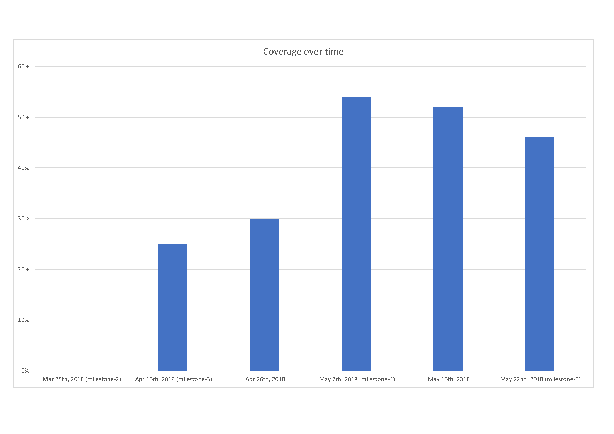

# Quality assurance concept

## Basics
1. Branching model (git-flow)
2. Issues and merge requests
3. Code style guides using [Google CodeStyle][1], enforced with gradle task and IntelliJ.  
4. Unit tests with JUnit and Mockito
5. Code metrics (test coverage via jacoco)
6. Play testing (functionality is tested by team on different physical machines)
7. Automatic testing  
  7.1 Continuous integration  
  7.2  Continuous deployment (via Docker -> [Image][2])

## Workflow
1. After a release, pull the ``master`` branch back into ``dev`` to get the latest hotfixes.
2. Create your new feature branch from ``dev``.
3. Once you're done, create a merge request from your feature branch in to ``dev``.
4. Assign a colleague to review your code and complete the merge request.
5. Once all features for the next version are done, create a new ``release`` branch.
6. Then you need to update the version number, docs, write the changelog, play test, check the staging environment for bugs, etc.
7. Lastly, merge the ``release`` branch into master and tag the commit with the version number.
8. Go back to step 1.

## Quality characteristics
### 1. Efficiency / Latency
To ensure a fluid gaming experience, the server needs to be able to compute the data inside the game loop in a certain time frame. This is called the server tickrate. We are targeting a tickrate of 10 Hz per hosted game (up to 10 games) on the server (during a 4 player average). Is the server performing normally (faster than 10 Hz), the game loop is slowed down artificially with Thread.sleep().  
The chart in the image below shows a mostly stable frame rate of around 45 frames per second (fps) on the client with a fluctuation of +- 5 frames. This is sufficient for our purposes. An interesting remark: JavaFX tries to draw at a constant 60 fps, which clearly cannot be kept up with here. The server tick is artificially locked at 10 Hz, which works well, performance and gameplay wise. FPS and Tickrate are averaged over the last 100 values, then the last 20 entries are shown in the chart.  
We realized that this QA goal was rather difficult to examine, because we would have had to recruit a lot of people to help us diagnose our server efficiency. We also think that we overestimated our server's capabilities with the desired numbers stated above (10 games with an average of 4 players). Nevertheless, we were able to host 4 games with 3 players each on one server, while still maintaining a stable 10.0 ticks per second.

### 2. Reliability / Error tolerance 
The software is tested with junit unit tests. For the more intricate tests, the mockito framework was used to construct mock classes and simulate network connections. As a metric we use the code coverage percentage (``"degree to which the source code of a program is executed when a particular test suite runs".`` [Wikipedia][6]).  
The goal was to achieve a coverage of **35 %** (excluding gui packages). Currently, there are 146 unit tests and we are at **48 %** coverage, GUI packages excluded (May 19th, 2018). Some of the unit tests helped us find a few logic flaws in our code and others helped us building some trust in our message parsing system.

  

Below, we included a graphical representation of our code coverage over time. To get the data, we checked out the repository from milestone 2 to 5 and retrospectively generated the test coverage report. As the graph shows, we started using unit tests right around milestone 3, that's also where we first drafted our quality assurance goals. The big increase in coverage stems from excluding the GUI packages from report generation and implementing more complex unit tests (game logic). Since milestone 4, our coverage dropped slightly. The explanation for that is: (1) Already having reached our targeted coverage of 35 %, we stopped writing additional unit tests. (2) Since our project was still ongoing, we kept adding untested code, which decreased our coverage slightly.

## Merge requirements

| Branch            | Merge target          | Merge requirements          | Deployed to        |
| :---------------- | :-------------------- | :-------------------------  | :----------------- |
| ``master``    :   | -                     | -                           | [Production][3]    |
| ``release`` :     | ``️master``            | ✔️ Tests, ✔️ Build, ✔️ Doc    | [Staging][4]       |
| ``hotfix`` :      | ``release, master``   | ✔️ Tests, ✔️ Build, ✔️ Doc    | -                  |
| ``dev``       :   | ``release``           | ✔️ Tests, ✔️ Build, ✔️ Doc    | [Development][5]   |
| ``feature`` :     | ``dev``               | ✔️ Tests, ❌ Build, ❌ Doc   | -                  |

[1]: https://github.com/google/styleguide/blob/gh-pages/intellij-java-google-style.xml
[2]: https://hub.docker.com/u/subluminalthegame/
[3]: subluminal.tech:1790
[4]: staging.subluminal.tech:1790
[5]: dev.subluminal.tech:1790
[6]: https://en.wikipedia.org/w/index.php?title=Code_coverage&oldid=831669504
 